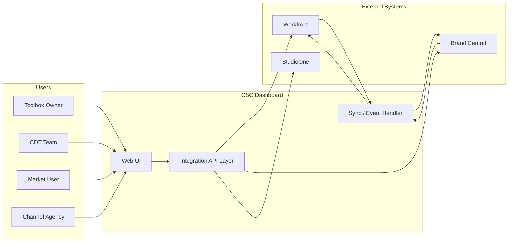

# CSC Dashboard — Technical Architecture

## 1.1 System context

The dashboard is the "single pane of glass" that orchestrates workflow and visibility. Brand Central remains the system of record for assets; Workfront for tasks and plans; StudioOne for creative brief handoff. The CSC app does not replace these systems—it integrates with them and can host UI that Brand Central may embed or link to.

## 1.2 Integration patterns

| System            | Role                                                     | Pattern                                                | Notes                                                                                                  |
| ----------------- | -------------------------------------------------------- | ------------------------------------------------------ | ------------------------------------------------------------------------------------------------------ |
| **Workfront**     | Tasks, projects, milestones, assignments, status         | REST API + webhooks (if available) or polling          | PRD: "Task status changes reflected within 5 minutes"; need auth (API key / OAuth per Workfront docs). |
| **Brand Central** | Assets, playbooks, library, "shopping basket", approvals | API/connector (TBD—depends on BC product capabilities) | Asset availability gating, publish playbook, Data Point Tracking.                                      |
| **StudioOne**     | Creative brief handoff                                   | Connector (design in Phase 0)                          | F7: "Integration with StudioOne for creative agency brief handoff."                                    |

- **Auth**: SSO/identity aligned with Brand Central and Workfront (e.g. SAML/OIDC); service accounts for server-side sync.
- **Sync strategy**: Polling (e.g. every 5 min) for Workfront status until webhooks are confirmed; event/callback from BC if supported, else polling for asset/approval state.
- **Our app**: Stateless API layer (sync jobs, REST/GraphQL for UI) + optional thin read-through cache (e.g. Redis) for dashboard performance; no duplicate "source of truth" for assets—IDs and metadata point to BC/Workfront.

## 1.3 Data flow (conceptual)

- **Programme / Milestone data**: Sourced from Workfront (and/or CSC Plan CSV import per F1). Dashboard reads via our API, which aggregates from Workfront (and CSV if used).
- **Assets**: Metadata and "availability" derived from Brand Central; no file storage in CSC app. Asset refs (ids, versions) stored for basket and brief context.
- **Briefs**: Created in-app when Market User submits basket (F4); brief record links to Workfront task(s) and BC asset refs; status kept in sync from Workfront.
- **Playbooks**: Playbook builder (F2) uses template and asset refs; "publish" triggers BC publish (via BC API) and version history can be stored in our DB or in BC depending on BC capabilities.

## 1.4 Data store (CSC app)

- **Needed for**: Briefs, basket drafts, playbook version metadata (if not fully in BC), user preferences, audit log (F7), risk digest state.
- **Recommendation**: Single relational DB (e.g. PostgreSQL) with clear boundaries—only data we own or cache for UX; no copy of full Workfront/BC data.
